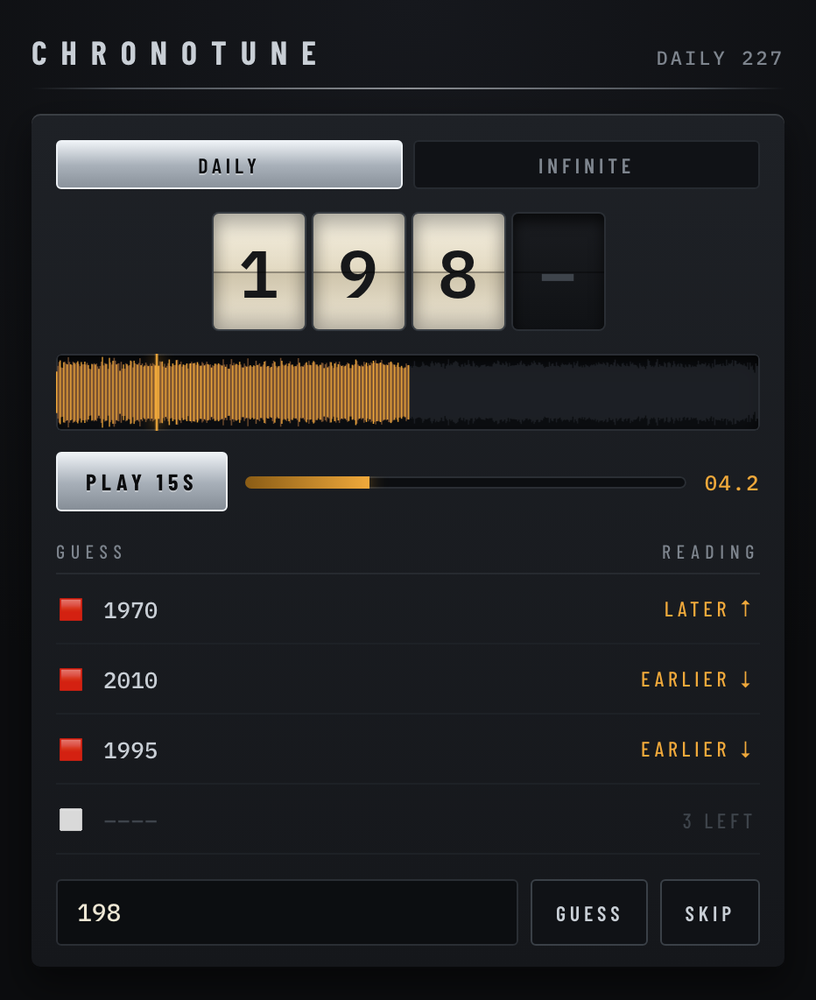

# Chronotune

A daily music game. A snippet plays; you guess the year the track was released.
Each wrong guess unlocks more audio and narrows the range. Results share as an
emoji grid. Infinite mode drops the daily constraint.

**[Play it →](https://an21p.github.io/chronotune/)**

<p align="center">
  
</p>

Six tries. The tape unlocks 1s, 5s, 10s, 15s, 20s, 25s — so an early guess is
worth more than a late one, and the reading beside it (`LATER ↑` / `EARLIER ↓`)
narrows the range whether or not the year was close.

The grid gives away the shape of a round and nothing else — no years, so
posting it cannot spoil the day for anyone:

```
CHRONOTUNE #142
🟥🟧🟩⬜⬜⬜
Solved in 3 · 🔊🔊🔊
```

## Running

    python3 -m venv .venv
    .venv/bin/pip install -r requirements.txt
    .venv/bin/python app.py

Then open http://127.0.0.1:5000

## Tests

    .venv/bin/pytest

The suite never touches the network — every network call is injected, so tests
pass fixtures instead.

## How it works

Two independent halves joined by a JSON contract:

- **`tools/`** — the offline builder. Curates the track pool by cross-checking
  three sources, then writes `data/tracks.json` and `data/daily_order.json`.
- **`chronotune/` + `app.py`** — the runtime. Reads those files and serves
  puzzles. Stateless; player progress lives in `localStorage`.

`tools/` never imports from `chronotune/` and vice versa — `data/*.json` is the
only contract between them, and a test enforces the boundary in both directions.

The frontend has a third seam. `static/app.js` never calls an endpoint; it calls
`window.ChronotuneAPI`, which is supplied by whichever backend script loaded
first — `api-server.js` under Flask, `api-static.js` in the deployed build. One
UI, two backends, no forked copy.

Audio comes from Deezer's free 30-second preview MP3s. Those URLs carry an
expiry token (~7h), so only the track id is stored and the URL is resolved per
request. The MP3s serve `access-control-allow-origin: *`, which is what lets the
browser decode them with the Web Audio API — giving a real waveform and a
sample-accurate stop at the snippet boundary, with no proxy in the path.

## The static build

Deployed to GitHub Pages at [an21p.github.io/chronotune/][live], as a submodule
of the portfolio repo. Pages serves static files only, so the Flask half is
replaced rather than hosted:

    .venv/bin/python build_static.py --out build

Every asset reference in the output is relative, so the same bundle works at the
site root or under `/chronotune/` with no base-path substitution.

Two problems have to be solved without a server:

**The audio.** `api.deezer.com` sends no `access-control-allow-origin`, so a
browser `fetch` is blocked — but it still honours JSONP, which is how
`api-static.js` resolves the preview URL. The preview MP3 it points at *does*
send `access-control-allow-origin: *`, so Web Audio decodes it directly, exactly
as under Flask.

**The answers.** The server withholds `track.year` until a round ends. A static
build has nowhere to withhold it, so the answers ship in `pool.json`, sealed
per-track by `chronotune/vault.py`. This is obfuscation, not secrecy, and cannot
be anything else — the browser must decode every answer, so the key travels with
the ciphertext. What it buys is that nothing is *readable*: no years or titles
in plain sight for a player who opens devtools out of curiosity. Defeating it is
deliberate work, which for a guessing game is the whole bar.

`vault.js` reimplements the keystream in JavaScript, and a test seals in Python,
unseals in node and asserts the two agree. That cross-language pin is the only
thing keeping them honest — a sign-extension slip on the JS side would decode
every track to garbage.

The rules are not restated in JavaScript. The ladder, guess ceiling, epoch and
proximity bands are read out of `chronotune/game.py` and `chronotune/puzzle.py`
at build time and baked into `pool.json`, so the browser cannot disagree with
the server about how the game works.

[live]: https://an21p.github.io/chronotune/

## Growing the track pool

Add `Artist - Title` lines to `data/seeds.txt`, then:

    .venv/bin/python tools/build_tracks.py --seeds data/seeds.txt

A track is accepted only when **MusicBrainz and Wikidata agree on the year**.

Deezer decides availability and supplies the audio but gets **no vote on the
year**. Its `release_date` reflects whichever album edition a search lands on,
which for catalogue artists is usually a remaster or compilation — it dates
Billie Jean to 2009 and Bohemian Rhapsody to 2005. Measured over 15 well-known
tracks, requiring all three sources to agree accepted 3; requiring only
MusicBrainz and Wikidata accepted 11, every one of them correct.

Wikidata fails safe: when it has no data it returns nothing rather than a wrong
year, so it can decline to vouch for a track but can never poison the pool.

Expect roughly 70% of seeds to survive. Rejections land in `data/rejects.json`
with a reason:

| Reason | Meaning |
|---|---|
| `no_deezer_match` | No streamable non-variant track found |
| `mb_missing` | MusicBrainz has no release-group date |
| `wd_missing` | Wikidata has no publication date |
| `year_conflict` | The two sources disagree |

Reruns skip both accepted and rejected seeds, so adding 20 seeds costs 20
lookups rather than re-querying the whole file. The run is resumable — progress
is written after every acceptance — and rate-limited to MusicBrainz's published
1 request/second.

### `daily_order.json` is append-only

`data/daily_order.json` fixes which track each calendar day serves. The builder
only ever appends to it.

Reordering or removing an entry would change the song players got on days they
have **already played** and invalidate every result they shared. So it is an
enforced invariant, not a convention:

1. The builder asserts the existing file is an exact prefix of the new one
   before every write, and aborts with a non-zero exit otherwise.
2. The app refuses to start if `daily_order` references a track missing from
   `tracks.json`, or if it is empty.
3. Tests pin that the guard runs, and runs *before* the write it protects.

A track rejected on a later rerun is **not** removed from `daily_order` —
removal would shift every subsequent day. It stays, and the startup check
surfaces it as a hard error to be resolved deliberately.

## Design

The interface is a tape deck in dark chrome. Two rules govern it, and extending
the UI means keeping them:

- **Chrome is structure.** The metallic gradient appears only on edges that
  would catch light on real hardware — the hairline rule, the active mode key,
  the Play key. Nowhere else.
- **Amber is state.** `#F0A93B` marks what is currently live: the playhead, the
  VU fill, the unlocked seconds, the direction hints. Nothing decorative is
  amber, which is what makes it readable at a glance.

Barlow Condensed for equipment labelling, Archivo for prose, IBM Plex Mono for
every number. One column at all sizes, capped at `--deck-width` and centred,
with the dark field bleeding to the edges.

The approved mockup is `docs/design/tape-deck-dark-reference.html` — the
implementation follows it rather than re-deriving it. See
`docs/superpowers/specs/2026-08-14-chronotune-design.md` for the full design and
the research behind it, and `docs/superpowers/plans/` for the implementation
plan.

## Known gaps

- The frontend has no automated tests; it was verified by hand, and both
  backends were driven through a full round in a real browser.
- Answers in the static build are obfuscated, not hidden. See above.
- Spotify stream-count mode is out of scope — no free or licit data source
  exists. Spotify's API exposes only a relative 0–100 popularity score.
- Client-side enforcement of the snippet limit is not tamper-proof. It is a
  game; the cost of defeating it exceeds the reward.
